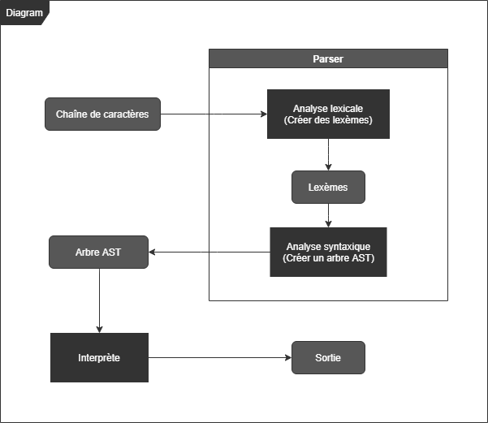
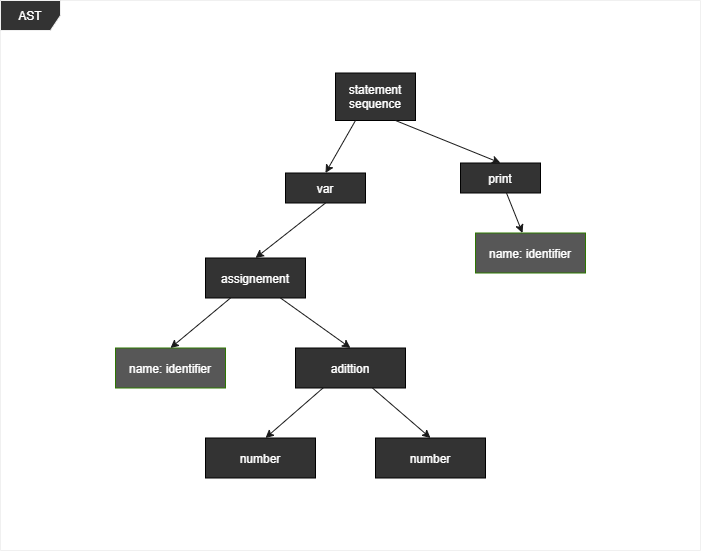

# Interpreter



## Grammaire [EBNF]

```bnf
Statement
    ::= print ExpressionList
    | var Identifier

ExpressionList
    ::= ([a-zA-Z_]+ | Expression)

Identifier
    ::= [a-zA-Z_][a-zA-Z0-9_]+

Number
    ::= Digit Digit+

Digit
    ::= [0-9]+
```

## Exemple

```js
var identifier = 1 + 1
print identifier
```

## AST (Arbre de la syntaxe abstraite)



## Usage

```bash
$ cmake --preset=default
$ cmake --build --preset=default
$ ./build/default/Debug/interpreter.exe
```

## Réréfences

- [Interpreter](https://fr.wikipedia.org/wiki/Interpr%C3%A8te_(informatique))
- [Analyse lexicale](https://fr.wikipedia.org/wiki/Analyse_lexicale)
- [Analyse syntaxique](https://fr.wikipedia.org/wiki/Analyse_syntaxique)
- [Arbre de la syntaxe abstraite](https://fr.wikipedia.org/wiki/Arbre_de_la_syntaxe_abstraite)
