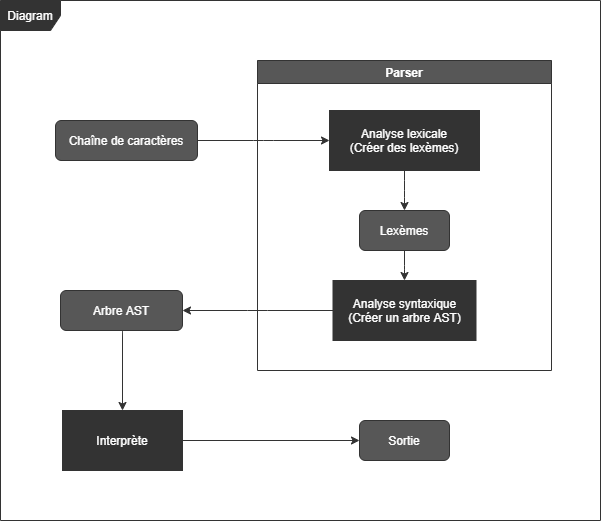

# Interpreter

[Documentation (Code)](https://themonsterdev.github.io/interpreter)

- Déclaration de variable (`'var'`).
- Assignation de variable (`'var identfier = {ExpressionList}' | 'identfier = {ExpressionList}'`).
- Opérateurs arithmétiques (`'*' | '+' | '-' | '/' | '%'`).
- Opérateurs de comparaison (`'==' | '>' | '>=' | '<' | '<=' | '!='`).
- Imprimer le résultat (`'print'`).



## Grammaire [EBNF]

```ebnf
Statement
    ::= print ExpressionList
    | var Identifier
    | var Identifier '=' ExpressionList
    | Identifier '=' ExpressionList

ExpressionList
    ::= Identifier
    | ArithmeticOperatorExpression
    | ComparisonOperatorExpression

ArithmeticOperatorExpression
    ::= (Number | Identifier) '*' (Number | Identifier)
    | (Number | Identifier) '+' (Number | Identifier)
    | (Number | Identifier) '-' (Number | Identifier)
    | (Number | Identifier) '/' (Number | Identifier)
    | (Number | Identifier) '=' (Number | Identifier)
    | (Number | Identifier) '%' (Number | Identifier)

ComparisonOperatorExpression
    ::= (Number | Identifier) '==' (Number | Identifier)
    | (Number | Identifier) '>' (Number | Identifier)
    | (Number | Identifier) '>=' (Number | Identifier)
    | (Number | Identifier) '<' (Number | Identifier)
    | (Number | Identifier) '<=' (Number | Identifier)
    | (Number | Identifier) '!=' (Number | Identifier)

Identifier
    ::= [a-zA-Z_][a-zA-Z0-9_]+

Number
    ::= [0-9]+
```

## Exemple

```js
print 1 + 1

var identifier = 1 + 1
print identifier

identifier = 2 - 1
print identifier

identifier = 2 * 3
print identifier

identifier = 6 / 3
print identifier

identifier = 6 % 2
print identifier

identifier = 1 + 1 - 1 * 2 / 2 % 2
print identifier
```

## AST (Arbre de la syntaxe abstraite)


## Usage

```bash
$ cmake --preset=default
$ cmake --build --preset=default
$ ./bin/interpreter.exe ./examples/operators.txt
```

## Réréfences

- [Interpreter](https://fr.wikipedia.org/wiki/Interpr%C3%A8te_(informatique))
- [Interpréteur (patron de conception)](https://fr.wikipedia.org/wiki/Interpr%C3%A9teur_(patron_de_conception))
- [Analyse lexicale](https://fr.wikipedia.org/wiki/Analyse_lexicale)
- [Analyse syntaxique](https://fr.wikipedia.org/wiki/Analyse_syntaxique)
- [Arbre de la syntaxe abstraite](https://fr.wikipedia.org/wiki/Arbre_de_la_syntaxe_abstraite)

## Resources

- [Railroad Diagram Generator](https://www.bottlecaps.de/rr/ui)
